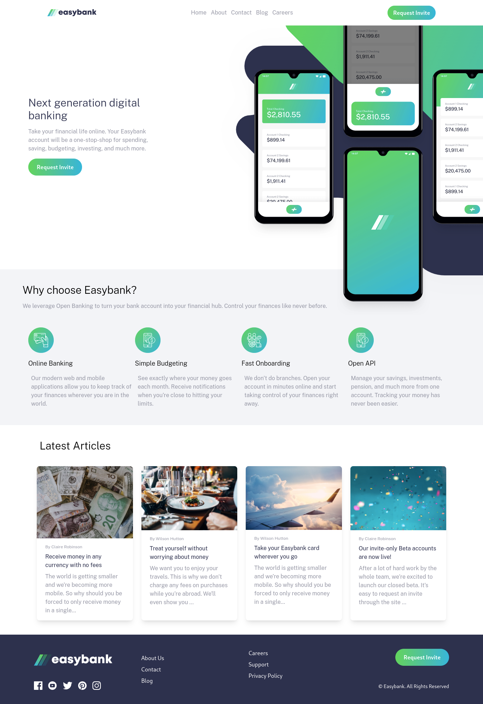

# Frontend Mentor - Easybank landing page solution

This is a solution to the [Easybank landing page challenge on Frontend Mentor](https://www.frontendmentor.io/challenges/easybank-landing-page-WaUhkoDN). Frontend Mentor challenges help you improve your coding skills by building realistic projects. 

## Table of contents

- [Overview](#overview)
  - [The challenge](#the-challenge)
  - [Screenshot](#screenshot)
  - [Links](#links)
- [My process](#my-process)
  - [Built with](#built-with)
  - [What I learned](#what-i-learned)
  - [Continued development](#continued-development)
  - [Useful resources](#useful-resources)
- [Author](#author)
- [Acknowledgments](#acknowledgments)

## Overview

### The challenge

Users should be able to:

- View the optimal layout for the site depending on their device's screen size
- See hover states for all interactive elements on the page

### Screenshot

(desktop image)

### Links

- Solution URL: [solution URL](https://github.com/sinclare210/easybank_project)
- Live Site URL: [live site URL](https://easybank-project-xl2c.vercel.app/)

## My process

### Built with

- Semantic HTML5 markup
- Tailwind CSS
- Flexbox
- CSS Grid
- Mobile-first workflow

### What I learned

This project, was built using tailwind css, i learnt about grid-cols, this tailwind property helps you control the number of card you want to see on a row depending on the screen size.

Secondly, i learnt about javascript dom, because it was used to build the mobile navbar.

### Continued development

I need to work on Tailwind css postioning, it was the main issue on the project. It was tiresome.

### Useful resources

- [Card Creation](https://v1.tailwindcss.com/components/cards) - This resource help me in creating a card in tailwind css.

## Author

- Frontend Mentor - [@sinclare210](https://www.frontendmentor.io/profile/sinclare210)
- Twitter - [@Sincla1Olajuwon](https://x.com/Sincla1Olajuwon?t=9Rl_pnqS5YlDRBy-PVlhWQ&s=09)

